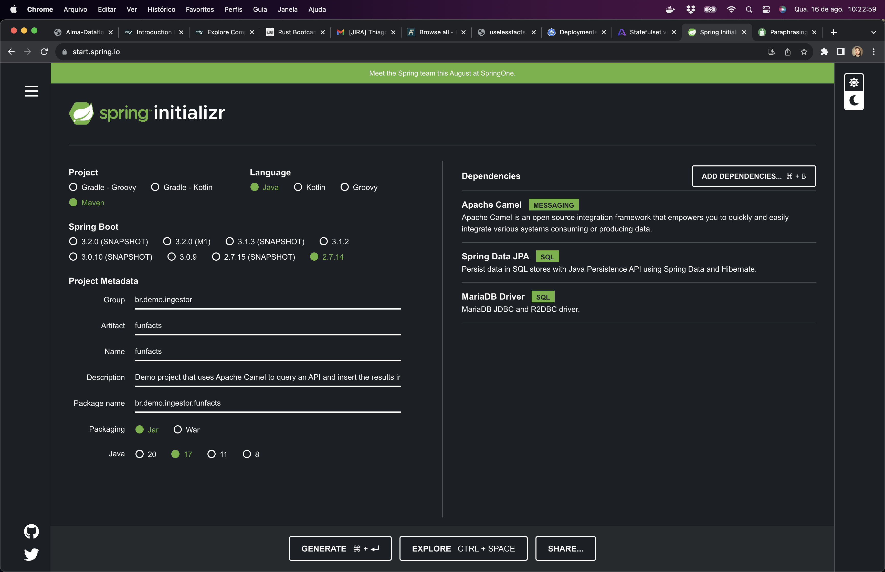

# Exemplo de aplicação usando Apache Camel e JPA

Essa é uma aplicação de exemplo que demonstra como usar o Apache Camel para construir uma rota que acessa a API https://uselessfacts.jsph.pl/api/v2/facts/random, 
faz o parse do retorno e armazena o resultado no banco de dados.

Quase todos os arquivos têm comentários úteis. Dê uma olhada em cada um deles.

## Estrutura

O projeto é composto das seguintes pastas e arquivos:

- **database**: contém os scripts SQL e o Dockerfile para a criação de um serviço baseado em Flyway. Esse serviço é responsável por criar toda a estrutura de banco de dados.
- **ingestor**: a aplicação Spring Boot que executa as rotas do Apache Camel.
- **docker-compose.yaml**: contém as instruções para build e execução das imagens Docker.

Todas as pastas contém um arquivo `Dockerfile` com as instruções para a criação das imagens Docker.

## Instalação e execução

Primeiro execute o maven para compilar o projeto:

```shell
mvn clean package
```

Após isso execute o comando:

```shell
docker compose up --build
# ou docker-compose up --build caso você esteja usando o docker-compose standalone
# o argumento --build não é necessário, é apenas para deixar explícito que o docker-compose deve criar as imagens antes de executar
```

Você verá o resultado da execução no log do docker-compose e também no banco de dados.

### Acessar o banco de dados

Para acessar o banco de dados, execute o docker compose e conecte em `localhost:3306` com as credenciais:

| user        | password   |
|-------------|------------|
| mariadbuser | mariadbpwd |

## Execução somente do banco de dados e do Flyway

Execute o comando:

```shell
docker-compose up database database-migrations
```

Dessa forma apenas o banco de dados e o Flyway (os scripts SQL) executarão.

Assim você poderá executar a aplicação Spring Boot direto no IDE ou no console.

## Removendo todos os containers

Após parar o docker-compose com `CTRL+C` execute o seguinte comando para remover todos os containers a rede do Docker:

```shell
docker-compose down --remove-orphans
```

## Projeto Spring Boot

O projeto foi criado usando o [spring initializr](https://start.spring.io/) com as seguintes configurações:



## Referências

- [Flyway](https://flywaydb.org/)
- [Apache Camel](https://camel.apache.org/)
- [Apache Camel - Getting Started](https://camel.apache.org/camel-core/getting-started/index.html)
- [Docker Compose](https://www.baeldung.com/ops/docker-compose)
- [Dockerfile](https://docs.docker.com/engine/reference/builder/)
- [Build Docker images](https://devopscube.com/build-docker-image/)
